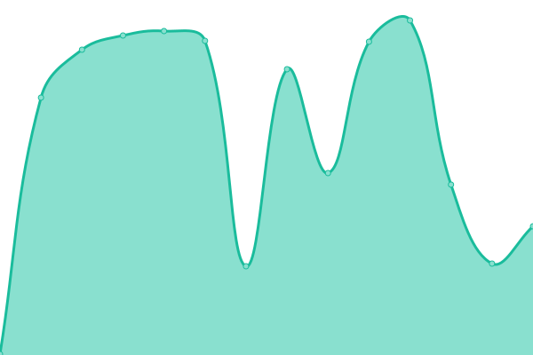
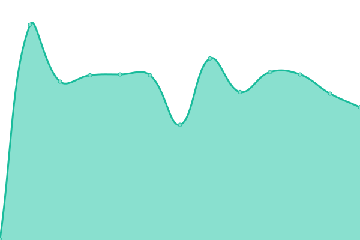

# [📈 Live Status](https://demo.upptime.js.org): <!--live status--> **🟩 All systems operational**

This repository contains the open-source uptime monitor and status page for [Fabio Issamu Oshiro](https://twitter.com/fabiooshiro), powered by [Upptime](https://github.com/upptime/upptime).

With [Upptime](https://upptime.js.org), you can get your own unlimited and free uptime monitor and status page, powered entirely by a GitHub repository. We use [Issues](https://github.com/fabiooshiro/upptime/issues) as incident reports, [Actions](https://github.com/fabiooshiro/upptime/actions) as uptime monitors, and [Pages](https://demo.upptime.js.org) for the status page.

<!--start: status pages-->
<!-- This summary is generated by Upptime (https://github.com/upptime/upptime) -->
<!-- Do not edit this manually, your changes will be overwritten -->
<!-- prettier-ignore -->
| URL | Status | History | Response Time | Uptime |
| --- | ------ | ------- | ------------- | ------ |
|  [Pinbank.com.br](https://pinbank.com.br) | 🟩 Up | [pinbank-com-br.yml](https://github.com/Calindra/pinbank_upptime/commits/HEAD/history/pinbank-com-br.yml) | 

 493ms
     
 | 

<a href="https://demo.upptime.js.org/history/pinbank-com-br">100.00%</a>
    

|  [Pix API](pinbank.com.br/services/api/Pix/SolicitarEcommerceQrCode) | 🟩 Up | [pix-api.yml](https://github.com/Calindra/pinbank_upptime/commits/HEAD/history/pix-api.yml) | 

 235ms
     
 | 

<a href="https://demo.upptime.js.org/history/pix-api">100.00%</a>
    

|  [Acesso a conta](https://acessoaconta.com.br/Login/) | 🟩 Up | [acesso-a-conta.yml](https://github.com/Calindra/pinbank_upptime/commits/HEAD/history/acesso-a-conta.yml) | 

 198ms
     
 | 

<a href="https://demo.upptime.js.org/history/acesso-a-conta">100.00%</a>
    

<!--end: status pages-->

[**Visit our status website →**](https://demo.upptime.js.org)

## 📄 License

- Powered by: [Upptime](https://github.com/upptime/upptime)
- Code: [MIT](./LICENSE) © [Anand Chowdhary](https://anandchowdhary.com), supported by [Pabio](https://pabio.com)
- Data in the `./history` directory: [Open Database License](https://opendatacommons.org/licenses/odbl/1-0/)
